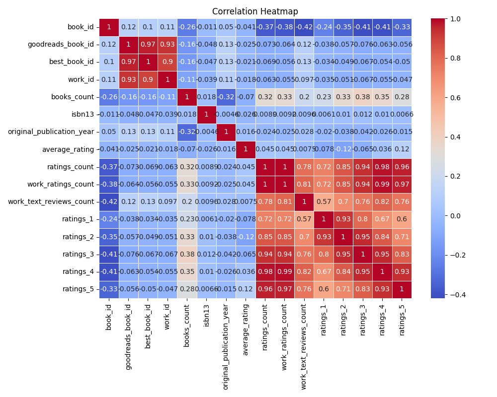
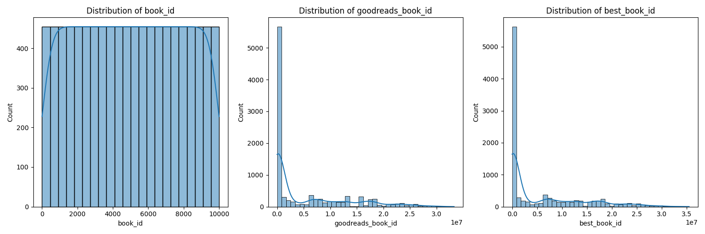

# An Exploration of the Literary Universe: Insights from a Book Ratings Dataset

## 1. Overview of the Dataset

In a world awash with literary choices, our dataset presents a treasure trove of insights into the books that resonate with readers. Containing **10,000 rows** and **23 columns**, this dataset encompasses vital details about various books including their titles, authors, publication years, ratings, and much more. Each entry is a reflection of readers' sentiments, captured through ratings and reviews. 

Key columns in the dataset include:
- **book_id**: Unique identifier for each book
- **average_rating**: The average reader rating out of 5
- **ratings_count**: Total number of ratings received
- **authors**: Names of the authors
- **original_publication_year**: Year the book was published

With certain columns rich in data and others less so—most notably the issues with ISBN numbers, titles, and language codes—this dataset provides an opportunity to delve deeper into the literary preferences of readers.

## 2. Summary Statistics: Interesting Observations

Looking at the summary statistics, some intriguing patterns emerge:

- **Diversity in Ratings**: The dataset boasts a spectrum of ratings, from 1-star to 5-star, illuminating the polarized reviews some books receive. The top-rated books (with higher entries in ratings_5) suggest an intense love or hatred, often leading to fascinating contrasts.
  
- **Authors and Their Impact**: Many authors are represented multiple times—some emerging as clear favorites with high ratings and counts, while others show a stark divide in responses. A small selection of *hyped* authors commanded the majority of ratings, indicating their established fan bases.

- **Year of Publication**: An interesting correlation can be observed between publication years and average ratings; newer releases often attract substantial attention and subsequently higher ratings. Yet, classics that have stood the test of time also rate exceptionally high, showcasing an enduring appeal across generations.

- **Missing Values**: 
    - **ISBN Data Issues**: A notable 700 missing ISBN entries could obscure analysis related to book editions or geographical availability.
    - **Title Attrition**: The presence of 585 missing original titles provides a gap that leaves questions unanswered about popular works in the database.
    - **Language Barriers**: With 1,084 missing language codes, insights into the global reach versus local appeal of certain titles remain elusive.

## 3. Potential Insights and Implications

The richness of this dataset presents numerous avenues for further exploration:

- **Reader Preferences**: Analyzing average ratings juxtaposed with authors’ profiles can illuminate trends in reader preferences tied to genres, styles, and themes. This can be leveraged by publishers to tailor their upcoming releases.

- **Cultural Insights**: With filtered analysis on language codes, it can uncover whether particular languages have notably different average ratings. Such insights could inform translation and international marketing strategies for books.

- **Impact of Reviews**: A deeper dive into the relationship between work text reviews and ratings could yield insights into how qualitative feedback shapes overall perceptions. This may highlight the importance of community engagement in building a book's reputation.

## 4. Recommendations for Further Analysis

To harness the full potential of this dataset, several paths for further analysis are recommended:

- **Fill in the Gaps**: Start with imputing missing values for ISBN and original titles to unify analysis across entries. Exploring external databases may also yield supplementary details necessary for complete insights.

- **Time Series Analysis**: A dynamical analysis can be conducted on ratings over time, permitting understanding of how publication timing and societal trends may impact reception.

- **Clustering Analysis**: Using clustering techniques to identify groups of books or authors sharing similar characteristics (like genres or themes) can reveal underlying trends within reader preferences—assisting in targeted marketing efforts.

- **Visualizations**: Development of engaging visual representations of the ratings, such as heat maps or rating trend lines over time, could provide intuitive data interpretations. 

In conclusion, this dataset not only sheds light on the intricacies of literary appreciation but also opens the door to deeper explorations that could enrich our understanding and enhance the reading experience for audiences worldwide. It’s a compelling observation of how words written on a page can ignite conversation and memory across an array of readers.

## Data Visualizations

