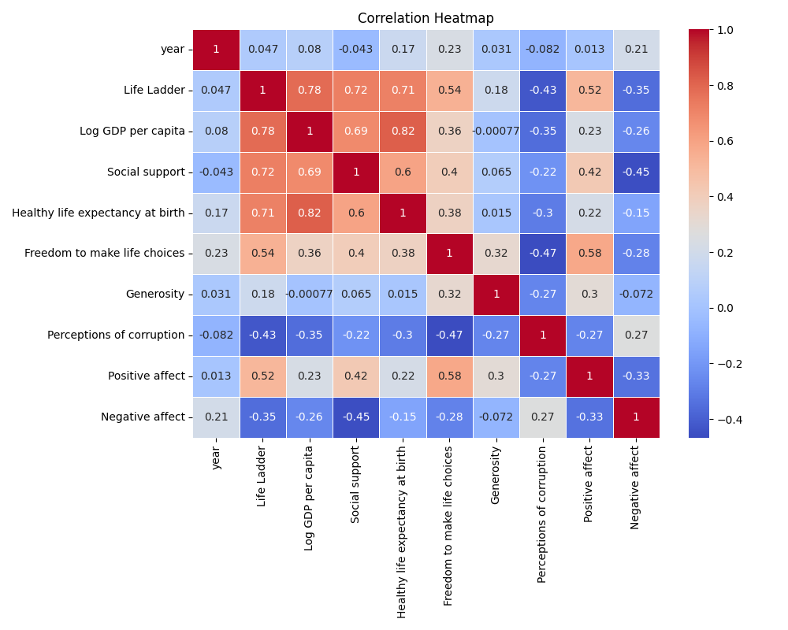
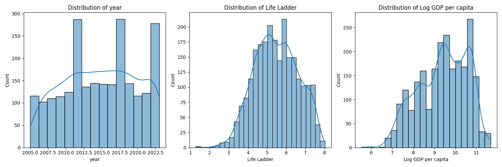

# The Pursuit of Happiness: Analyzing Global Well-Being Data

## 1. Dataset Overview

Imagine a world where happiness is quantifiable. Enter our dataset, a rich tapestry of human experience, aggregated from 2363 entries across 11 columns. Each row represents a snapshot of life in various countries across different years, reflecting dimensions that contribute to overall well-being. 

### Key Metrics:
- **Life Ladder**: A measure of how individuals rate their own happiness on a scale of 0 to 10.
- **Log GDP per capita**: An economic indicator that provides an insight into a country's wealth.
- **Social support**: The perceived availability of support in times of need.
- **Healthy life expectancy at birth**: The average number of years a newborn is expected to live in good health.
- **Freedom to make life choices**: The extent to which individuals feel they have the liberty to pursue their desired lifestyle.
- **Generosity and perceptions of corruption**: Variables that delve into the moral fabric of societies and how they influence collective happiness.
- **Positive and negative affect**: Measures of emotional experiences that range from joy to sadness or frustration.

## 2. Insights from Summary Statistics

Delving into the data, several insightful patterns emerge:

- **Missing Data**: Our dataset shows missing values predominantly in Generosity (81 missing), Perceptions of corruption (125 missing), and Freedom to make life choices (36 missing). This challenges the robustness of the analyses we can perform on these key metrics, hinting at potential gaps in understanding certain societal dimensions of happiness.
  
- **Happiness Meets Wealth**: Life Ladder ratings often correlate with Log GDP per capita. As expected, wealthier countries tend to exhibit higher life satisfaction, but this is not universally true. Knowing how economic prosperity doesn’t always equate to genuine happiness could shape how we approach social policies related to well-being.

- **Social Support Matters**: Countries with the highest life satisfaction ratings also exhibit high levels of reported social support. This connection emphasizes the importance of community, family, and friendships in not just enriching lives, but in making them happier.

- **The Freedom to Choose**: In nations where individuals report more freedom to make choices about their lives, happiness levels tend to be elevated. This raises questions about the role of governance and individual liberties in shaping national well-being.

## 3. Implications of Findings

The relationship between these various factors signals key implications for policymakers, social scientists, and community leaders:

- **Economic Policy and Welfare**: The data suggests that focusing solely on economic metrics such as GDP growth may not lead to enhanced happiness. Policymakers must also invest in social infrastructure and opportunities for community building.

- **Health Initiatives and Education**: The stark differences observed in healthy life expectancy across nations should spur initiatives aimed at improving healthcare and education systems. Healthier populations tend to report higher life satisfaction levels.

- **Addressing Corruption**: The perception of corruption negatively affects happiness levels. Countries must pursue transparency and good governance if they hope to improve life satisfaction ratings among their citizens.

## 4. Recommendations for Further Analysis

This dataset serves as a starting point for deeper explorations into global happiness. Here are several pathways for further analysis:

- **Missing Values Analysis**: Conduct analyses to determine the impact of missing values upon outcomes and explore potential imputation techniques to maintain the integrity and robustness of future conclusions.

- **Temporal Trends**: Investigate how happiness, economic factors, and social support have changed over time across different nations. This analysis could highlight the effectiveness of specific policies or social movements.

- **Cross-National Comparisons**: Delve into why certain countries succeed in creating happier societies despite limitations in economic wealth. What cultural, social, or governmental practices contribute to happiness?

- **Correlation and Causation Studies**: Employ statistical methods to better understand how these variables interact and predict life satisfaction, potentially using machine learning algorithms to unearth hidden patterns.

## Conclusion

This dataset on global well-being holds potential not just for understanding current grains of happiness but also for shaping future societal happiness. By synthesizing these insights, we can make contributions towards a world where happiness is not just a fleeting feeling but a comprehensible, achievable goal for all.

## Data Visualizations

