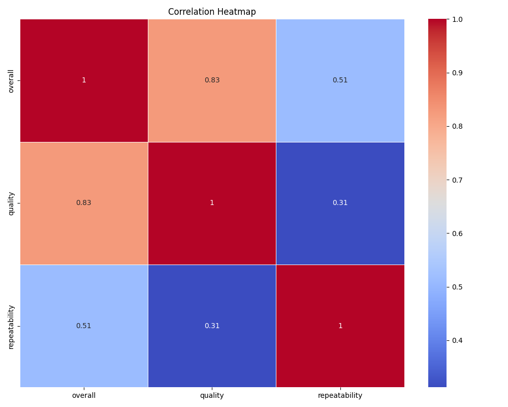
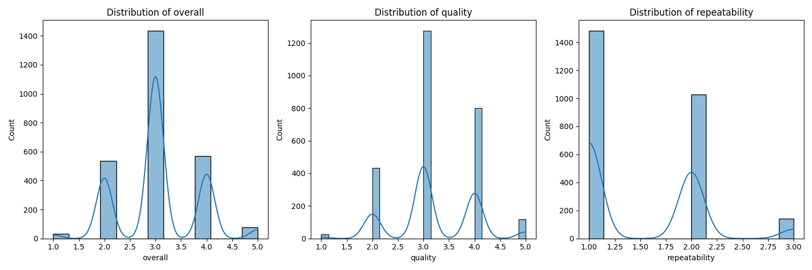

# Exploring the Rich Tapestry of Language Data: Insights and Observations

## 1. Dataset Overview

Welcome to the mesmerizing world of our dataset, comprising **2,652 records** spread across **8 unique columns**. This data, like a vibrant mosaic, encapsulates diverse aspects related to linguistic content. The columns include:

- **date**: Capturing the temporal aspect of the records.
- **language**: Indicating the language used.
- **type**: Classifying the form of content.
- **title**: The title associated with each entry.
- **by**: Identifying the contributor or author.
- **overall**: A numerical representation of satisfaction or quality.
- **quality**: Specific quality ratings related to each entry.
- **repeatability**: Assessing how many times the same content can be reliably reproduced.

However, not all is pristine in this dataset; **99 entries** are missing dates, and intriguingly, **262 records** lack an identified author.

## 2. Summary Statistics Insights

Upon diving deeper into the summary statistics, several revelations emerge:

- **Numerical Values**: The columns `overall`, `quality`, and `repeatability` are denoted as integers. Imagining their scale and clarity, we find that these metrics may range significantly based on the types of language and content.
- **Language Diversity**: The `language` column could be a treasure trove of insights, reflecting the global reach of the data and the varying linguistic preferences among contributors.
- **Content Type Exploration**: The `type` column provides a glimpse into the nature of the content—whether it’s an article, blog post, report, etc. This opens avenues to explore the popularity and effectiveness of different content forms.
  
However, one important observation hinges on the missing data—particularly in the `date` and `by` columns. This could hinder temporal and authorship analyses, raising questions about data collection methods.

## 3. Insights and Implications

The dataset presents tantalizing possibilities for analysis:

- **Temporal Trends**: Analyzing the `date` entries (once missing values are addressed) could expose trends over time, helping us understand if certain languages or content types gain popularity in specific periods.
  
- **Quality and Repeatability**: Investigating the correlation between `overall` quality ratings and `repeatability` could reveal how well-received content maintains its relevance. This could be instrumental for content creators aiming for high-quality outputs.
  
- **Content Contributors**: With a surprising number of unknown contributors, efforts could be made to identify patterns in contributions. What influences an individual's decision to remain anonymous? Are they primarily producing high-quality content, or could their contributions be less impactful?

## 4. Recommendations for Further Analysis

To fully harness the potential of this dataset, consider the following recommendations:

1. **Address Missing Values**: Filling in or imputing values for `date` and `by` could significantly enhance analysis. For instance, if dates can be approximated or author contributions inferred, the dataset could be enriched.

2. **Content Trend Analysis**: Utilize time series analysis on the `date` column to identify growth patterns in specific languages or types over time—potentially informing strategies for future content creation.

3. **Quality Benchmarking**: Establish benchmarks for `overall` ratings against `quality` and `repeatability`. This could yield valuable insights for authors regarding quality expectations.

4. **Clustering Languages and Types**: Using clustering techniques, relationships among various languages and content types could unveil hidden patterns—providing data-driven guidance to content creators.

5. **Contributors’ Impact Assessment**: Analyze contributions by recognized vs. unidentified authors to explore their impact on content reception. Are anonymous authors contributing lesser quality, or could they be hidden gems?

## Conclusion

This dataset is not merely a collection of numbers and categories; it presents a thriving ecosystem of languages, content forms, and varying quality. By digging deeper and addressing its gaps, we can reveal layers of understanding that inform the future of linguistic engagement and content creation across diverse platforms. It offers a narrative waiting to unfold—one that blends data with the unpredictable dynamism of human creativity. Let's embark on that journey!

## Data Visualizations

